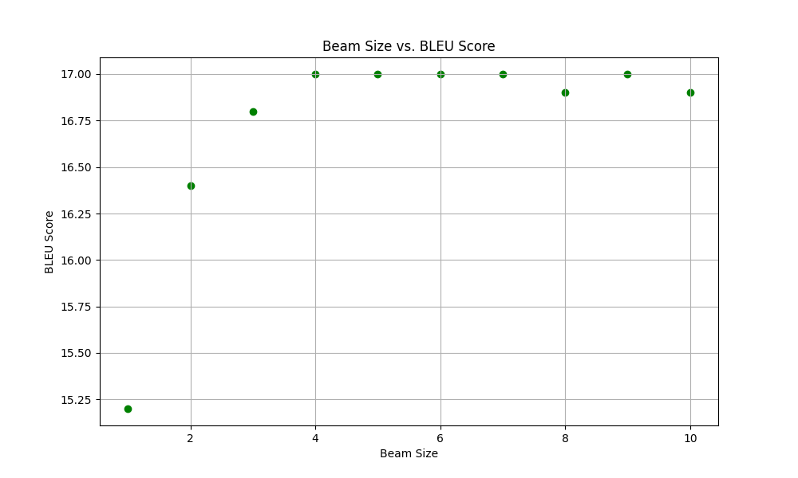

# MT Exercise 5: Byte Pair Encoding, Beam Search

This repository is a starting point for the 5th and final exercise. As before, fork this repo to your own account and
the clone it into your prefered directory.

## Requirements

- This only works on a Unix-like system, with bash available.
- Python 3 must be installed on your system, i.e. the command `python3` must be available
- Make sure virtualenv is installed on your system. To install, e.g.

  `pip install virtualenv`

## Steps

Clone your fork of this repository in the desired place:

    git clone https://github.com/[your-name]/mt-exercise-5

Create a new virtualenv that uses Python 3.10. Please make sure to run this command outside of any virtual Python
environment:

    ./scripts/make_virtualenv.sh

**Important**: Then activate the env by executing the `source` command that is output by the shell script above.

Download and install required software as described in the exercise pdf.

Download data:

    ./download_iwslt_2017_data.sh

Before executing any further steps, you need to make the modifications described in the exercise pdf.

Train a model:

    ./scripts/train.sh

The training process can be interrupted at any time, and the best checkpoint will always be saved.

Evaluate a trained model with

    ./scripts/evaluate.sh

---

# Modifications (Task 1)

To activate venv:
source ./../venvs/torch3/bin/activate

Languages:

- English (src)
- German (trg)

So we take data with "en-de" (en->de).

## Sample Training Data

As mentioned in the exercise description, we should sub-sample the training data to 100k sentence pairs.
For doing this, we created a script in the `scripts`directory.

    sub_sample_training_data.py

This script takes the training data provided in the `data` directory and creates a sub-sampled version of it with 100k
sentence pairs and stores it in the `data_sampled` directory. It also provides a little sanity check if both files
contain the same number of lines. If you want to execute this script with your own data, please change the original data
source path in the script directly.

## Config Files

We added config files for the word-level and the bpe model in the `configs` directory.

    wordlevel_2.yaml
    bpe_2000.yaml
    bpe_5000.yaml

## Learn BPE model and create vocabulary file

As recommended, we have taken a look at this best practice implementation:
https://github.com/rsennrich/subword-nmt?tab=readme-ov-file#best-practice-advice-for-byte-pair-encoding-in-nmt

We did the following two times, once with vocabulary size 2000 and once with vocabulary size 5000.
We simply adjusted some parameters and file names in the scripts which is not mentioned further here.

In this repository, there is a command which can be executed after subword-nmt is installed (e.g. with pip)

```
subword-nmt learn-joint-bpe-and-vocab --input {train_file}.L1 {train_file}.L2 -s {num_operations} -o {codes_file} --write-vocabulary {vocab_file}.L1 {vocab_file}.L2
```

We replaced the following placeholders with our values:

- `L1` = en
- `L2` = de
- `num_operations` = 2000 (since recommended vocabulary size is 2000) or 5000 (experiment)
- `train_file` = sampled_train.en-de
- `codes_file` = bpe_code
- `vocab_file` = vocab

As mentioned in the task description, we should add the `--total-symbols` to ensure the vocabulary is
of the exact size you specify with the argument -s. Without this argument, the vocabulary
size is approximate since the set of single characters is not taken into account.

The code can be found in the `scripts` directory:

    bpe_learning.py

Now we have to create a joint vocabulary file. For this, we created the following script:

    create_joint_vocabulary.py

It concatenates both of the vocab output files from the previous step and removes counts (such as mentioned in the
exercise) and removes duplicates.

## Experiments

### Wordlevel

For the wordlevel model, we configured the model in the `wordlevel_2.yaml` file.
Here, we specified the `voc_limit` to 2000 such as mentioned in the exercise.
As tokenizer, we take moses.

### BPE 2000

For the BPE model with 2000 vocabulary size, we configured the model in the `bpe_2000.yaml` file and specified
the `voc_file` which we have created in the step before.

### BPE 5000

To experiment with the BPE model, we now have taken a vocabulary size of 5000.
We did again the steps before, created a new vocabulary file and specified it in the `bpe_5000.yaml` file.

## Evaluation

For our trained models we get the BLEU Score with the following scripts. We modified it according to our directory
structure and file names.

    evaluate_wordlevel2.sh
    evaluate_bpe_2000.sh
    evaluate_bpe_5000.sh

**Output for wordlevel:**

```
{
 "name": "BLEU",
 "score": 12.6,
 "signature": "nrefs:1|case:mixed|eff:no|tok:13a|smooth:exp|version:2.4.2",
 "verbose_score": "37.5/16.5/8.6/4.8 (BP = 1.000 ratio = 1.305 hyp_len = 39764 ref_len = 30475)",
 "nrefs": "1",
 "case": "mixed",
 "eff": "no",
 "tok": "13a",
 "smooth": "exp",
 "version": "2.4.2"
}
```

**Output for BPE 2000:**

```
{
 "name": "BLEU",
 "score": 16.5,
 "signature": "nrefs:1|case:mixed|eff:no|tok:13a|smooth:exp|version:2.4.2",
 "verbose_score": "51.8/23.5/12.4/6.8 (BP = 0.924 ratio = 0.927 hyp_len = 28244 ref_len = 30475)",
 "nrefs": "1",
 "case": "mixed",
 "eff": "no",
 "tok": "13a",
 "smooth": "exp",
 "version": "2.4.2"
}


```

**Output for BPE 5000:**

```
{
 "name": "BLEU",
 "score": 17.0,
 "signature": "nrefs:1|case:mixed|eff:no|tok:13a|smooth:exp|version:2.4.2",
 "verbose_score": "53.2/24.4/13.1/7.2 (BP = 0.908 ratio = 0.912 hyp_len = 27800 ref_len = 30475)",
 "nrefs": "1",
 "case": "mixed",
 "eff": "no",
 "tok": "13a",
 "smooth": "exp",
 "version": "2.4.2"
}
```

**Table with BLEU-Scores:**

|     | use BPE | vocabulary size | BLEU |  
|-----|---------|-----------------|------|
| (a) | no      | 2000            | 12.6 |   
| (b) | yes     | 2000            | 16.5 |   
| (c) | yes     | 5000            | 17.0 |  

**Observations**

- Our BPE model with vocabulary size 5000 scored the highest BLEU score (17.0), slightly better than the BPE model with
  the vocabulary size 2000 (16.5).
- Our worst model according to the BLEU score was the word level model with vocabulary size 2000, which was expected.

**Differences in translations**

Wordlevel:

- The wordlevel translation contains a lot of "unk" tokens, sometimes even a few in a row.
- Even with human judgment, it is often hard to understand the translation.
- But the general grammatical structure seems to be quite correct.

BPE:

- The BPE models do not contain "unk" tokens.
- Sometimes there are some repeating translations ore a bit strange words.
- Overall the BPE model seems to be more fluent and understandable than the wordlevel model, but still with a lot of
  flaws or mistakes.
- When only looking at the translations, I probably cannot differentiate which model is the 2000 and which is the 5000
  model. For me, it feels like they are quite equal in translation quality (the BLEU score indicates this too).

# Modifications (Task 2)

Since our BPE model with token size 5000 is the best, we take this one.
For this purpose, please take a look at the script:

    beam_size.py

For running this script, you first have to do `pip install ruamel.yaml`.

The script first creates 10 copies of the existing configuration file, each with a different beam size, from 1-10.
These are stored in the directory `configs/bpe_5000_beam_size`.

For the evaluation, please take a look at the following script:

    evaluate.py

Run this script in the `scripts` directory with `python3 evaluate.py` (Assuming you are in the venv and in the `scripts`
directory).

This script does basically the same as the already given `evaluate.sh` with some modifications.
The script takes the directory containing all the yaml-scripts with the different beam sizes and iterates through them.
For every file, it stores the translations and additionally the output (which would be otherwise written to the console)
in a .txt file in the directory `beam_size_translations`.
It also tracks time, but this doesn't seem to work properly.
But in the output produced by Joey NMT, there is also a time measurement, so we are just taking this for the
calculations.

For making the visualization, please take a look at the following script:

    beam_visualization.py

It first takes all the relevant statistics (BLEU, time taken) out of the translation files and stores them in a .csv
called `translation_metrics` again in the `beam_size_translations` directory. Further it reads the .csv file and creates
the two desired plots.

## Beam Size vs. BLEU Score




## Beam Size vs. Time Taken

